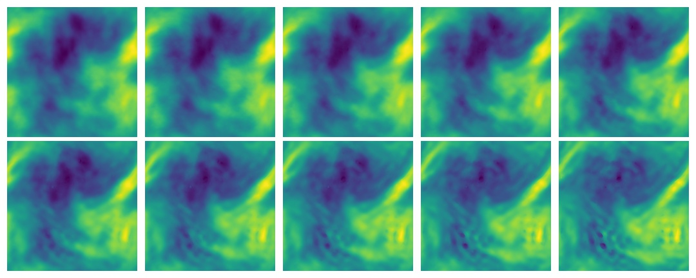

# 🎰🎰🎰 hackfest-ppl 🎰🎰🎰

Welcome to the CSIRO MLAI-FSP probabilistic programming hackfest notes!
Here you will learn how to combine modern tools of neural networks and deep learning etc, with (approximate) Bayesian reasoning, uncertainty analysis and realted techniques.
Does this solve all the problems? No.
But we argue that this provides access to more of on the pareto front trading off flexibility and computational efficiency.

Advanced case studies include experiment design, partial differential equations and whatever else you wish to bring to the party.




## Authors

- [Tom Blau](https://github.com/singulaire)
- [Dan MacKinlay](https://danmackinlay.name)

With input from

- Abdelwahed Khamis
- [Xuhui Fan](https://xuhuifan.github.io/)
- [Petra Kuhnert](https://people.csiro.au/K/P/Petra-Kuhnert)


## Now what?

Various notebooks walk you through different stages of the hackfest.

```text
probabilistic_programming_background.ipynb — introductory material
primitives/ — tutorial on basic operations in pyro
operator_inversion/ — advanced example using a neural network
variational_inference/ — inferring the posteriors of complex stochastic models
exercises/ — some exercises to get you started
```

## Install dependencies

This step should work for users on Linux, Macos.
It should also work for Windows users via the free Microsoft extension, [Windows Subsystem for Linux (WSL)](https://danmackinlay.name/notebook/wsl.html):

```bash
git clone https://github.com/csiro-mlai/hackfest-ppl
cd hackfest-ppl
```

Now, install the requirements.
Local desktop:

```bash
python3 -m venv --prompt hackfest-ppl ./venv
source ./venv/bin/activate
pip install -r requirements.txt
```

For Windows users who do NOT wish to installthe free  WSL, see below for an alternative.

If you wish to additionally visualize graphical models, you need the `graphviz` binary.
Depending on your platform this will be something like:

```bash
brew install graphviz       # MacOS with homebrew
conda install graphviz      # anaconda
sudo apt install graphviz   # Debian/ubuntu/WSL default
# etc
```

This step is optional and none of the actual computation requires graphviz, which is purely for visualisation.

## Developer setup

If you want to contribute back to this repository, please do.
To keep the storage small(er) we strip out all the notebooks using [nbstripout](https://github.com/kynan/nbstripout):

```bash
nbstripout --install --attributes .gitattributes
```

### Windows Setup without WSL {#windows-setup}

Windows without [WSL](https://danmackinlay.name/notebook/wsl.html) is a complicated BEAST!
To manage package installation for a wide range of packages, including python + extras, follow these instructions and it will get you part way there.

This was a nice [blog](https://medium.com/@bryant.kou/how-to-install-pytorch-on-windows-step-by-step-cc4d004adb2a) I found that helped me with my installation of python + extras.


Here are the main points!

1. You will need to install Anaconda from [here](https://www.anaconda.com/products/individual#windows).
	 - This is a great package manager that has over 200 packages you can install in a type of "docker" environment.  This is perfect for crappy Windows!
2. Once installed, open up "Anaconda Navigator" which will show the packages already preloaded.
3. To install packages
	 - Open up an Anaconda CMD window (not git bash, windows crappy cmd or anything else that comes installed with your priceless Windows machine!
	 - Then visit find the corresponding command in the table below. Note, as updates happen you might have to search the command in Anaconda (on website) and update.
	 - Other packages to install are via the "requirements.txt" script in the repo, which you can do via the following.  These commands were all found on anaconda.org (by searching). If these have already been installed, conda will let you know :).
	
	

Package	Commands

|Package    | Commands                                                                  |
| :----------- | :---------------------------------------------------------------------------|
|pytorch	  |  conda install pytorch torchvision torchaudio cudatoolkit=10.2 -c pytorch |
|pyro-ppl	  |  conda install -c conda-forge pyro-ppl |
|torchmetrics	| conda install -c conda-forge torchmetrics |
|python-dotenv |	conda install -c conda-forge python-dotenv |
|scikit-learn	| conda install -c conda-forge scikit-learn |
|seaborn	| conda install -c conda-forge seaborn |
|jupyterlab	| conda install -c conda-forge jupyterlab |
|wheel	| conda install -c conda-forge wheel |
|einops~=0.3.0	| conda install -c conda-forge einops |
|matplotlib	| conda install -c conda-forge matplotlib |
|h5py~=3.1.0	| conda install -c conda-forge h5py |
|graphviz~=0.18.2	| conda install -c main graphviz |
|                  | conda install python-graphviz |
|lxml | conda install -c conda-forge lxml |

Note, the graphviz installs should work but fails and seems to exclude some packages, hence the extra
install above.  You may also need to do the following at the Anaconda cmd prompt.

`pip install graphviz`

Alternatively you can try the classic [Graphviz on Windows forum hack](https://forum.graphviz.org/t/new-simplified-installation-procedure-on-windows/224).


Within Anaconda, you can load up an environment and see/check what has been installed. Alternatively you
can check with the command: `conda list`

#### Cloning the Repository

Cloning the repository for the hackfest:
```bash
git clone https://github.com/csiro-mlai/hackfest-ppl
cd hackfest-ppl
```

See information for installing Anaconda (above) to create a python environment for running scripts.

To create a separate environment for a project or experimentation, you can do this by issuing the following command
```bash
conda create --name hackfest-ppl
```		
You will then be prompted to activate the environment through something like
```bash
conda activate hackfest-ppl
```

You can easily deactivate it when you are finished
```bash
conda deactcivate hackfest-ppl
```


Then start a jupyter notebook and away you go. Evoila!

To Start a Jupyter Notebook in a specific directory, see this [blog](https://www.dev2qa.com/how-to-start-jupyter-notebook-in-anaconda-python-virtual-environment/) which
amounts to running this code: `jupyter notebook`

